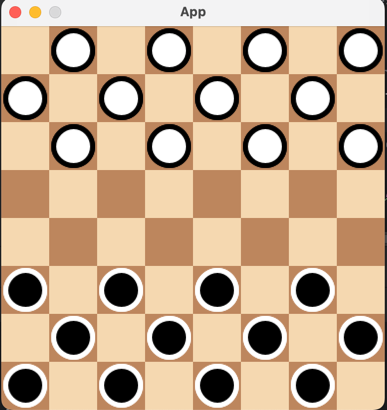

# 2D-CheckersGame
A small Checkers Game program in java language

## How to run the program
Use gradle run to run the program

## How to run the tests
Use gradle test to run the tests

## How to build the program
Use gradle build to build the program

## What is this program looks like

## How to play the game
1. The game is played on an 8x8 board only on the dark squares.
2. Each player starts with 12 pieces, placed on the dark squares of the three rows closest to that player's side.
3. The row closest to each player is called the "crownhead" or "kings row".
4. The player with the darker pieces moves first.
5. Players alternate turns.
6. A player may not move an opponent's piece.
7. A move consists of moving a piece diagonally to an adjacent unoccupied dark square. If the adjacent square contains an opponent's piece, and the square immediately beyond it is vacant, the piece may be captured (and removed from the game) by jumping over it.
8. Only the dark squares are used. A piece may move only diagonally into an unoccupied square.
9. When a piece is captured, it is removed from the board.
10. If a player is able to make a capture, there is no option; the jump must be made. If more than one capture is available, the player is free to choose whichever he or she prefers.
11. When a piece reaches the kings row on the opposite side of the board, it is "crowned" and becomes a king. Kings are limited to moving diagonally but may move both forward and backward. (Remember that single pieces, i.e. non-kings, are always limited to forward moves.)
12. Kings may combine jumps in several directions, forward and backward, on the same turn. Single pieces may shift direction diagonally during a multiple capture turn, but must always jump forward (toward the opponent).
13. A player wins the game when the opponent cannot make a move. In most cases, this is because all of the opponent's pieces have been captured, but it could also be because all of his pieces are blocked in.

